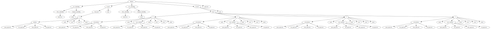

Please note that this is an anonymized version of the code presented in the paper "STRADA: Resource-Efficient Time-Series Anomaly Detection in Dynamically-Configured Systems". Any copyright notices identifying the authors or their organization have been redacted for the double-blind peer review. We are kindly asking the reviewers receiving this code to refrain from sharing it with non-reviewers.


# Torch Profiling Utils
This module contains two classes that simplify profiling Torch models using the [fvcore](https://github.com/facebookresearch/fvcore/tree/main) and [torchinfo](https://github.com/TylerYep/torchinfo) modules.
I designed the wrapper classes `FVCoreWriter` and `TorchinfoWriter` contained in this module around my profiling workflow and am sharing them in hopes that they may be useful for other group members.

## Installation
To install the module, run `make install` in the project root folder.

## Usage

### FVCoreWriter
The `FVCoreWriter` class wraps the Facebook Research [fvcore](https://github.com/facebookresearch/fvcore/tree/main) module.
It allows the retrieval of the FLOPs and activation counts of a model as a `dict`.
It also contains functions to store the retrieved values as JSON files.
The class is instantiated with the model to be profiled as well as the input data the model receives in the forward pass. If the model has multiple input parameters, pass them as as `tuple`.

```python
from torch_profiling_utils.fvcorewriter import FVCoreWriter

fvcore_writer = FVCoreWriter(model, input_data)
```

After instantiation, the FLOPs and activation counts, either by module or by operator, can be retrieved as `dict`s in the following manner:

```python
fvcore_writer.get_flop_dict('by_module')
fvcore_writer.get_flop_dict('by_operator')

fvcore_writer.get_activation_dict('by_module')
fvcore_writer.get_activation_dict('by_operator')
```

The FLOPs and activation counts can also be directly stored in JSON format using

```python
fvcore_writer.write_flops_to_json(output_filename_string, 'by_module')
fvcore_writer.write_flops_to_json(output_filename_string,'by_operator')

fvcore_writer.write_activations_to_json(output_filename_string, 'by_module')
fvcore_writer.write_activations_to_json(output_filename_string,'by_operator')
```

### TorchinfoWriter
The `TorchinfoWriter` class wraps the [torchinfo](https://github.com/TylerYep/torchinfo) module by Tyler Yep. 
It allows the retrieval of per-layer kernel shape, input and output shape, parameter count, and forward pass MACs.
The class is instantiated with the model to be profiled as well as the input data the model receives in the forward pass. If the model has multiple input parameters, pass them as as `tuple`.
After instantiation, call the `construct_model_tree()` method to construct the internal tree representation of the Torch modules contained in the model that have trainable parameters:
```python
from torch_profiling_utils.torchinfowriter import TorchinfoWriter

torchinfo_writer = TorchinfoWriter(model,
                                    input_data=input_data,
                                    verbose=0)

torchinfo_writer.construct_model_tree()
```

#### Printing of the model tree
Afterwards, you can print the constructed model tree, optionally including a list of module attributes.
```python
torchinfo_writer.show_model_tree(attr_list=['Parameters', 'MACs'])
```
The following is an example of the output of this function call on an Informer model:
```bash
Informer [Parameters=29378726, MACs=29378726]
├── enc_embedding [Parameters=180864, MACs=2893824]
│   ├── value_embedding [Parameters=176832, MACs=2829312]
│   │   └── tokenConv [Parameters=176832, MACs=2829312]
│   └── temporal_embedding [Parameters=4032, MACs=64512]
│       └── embed [Parameters=4032, MACs=4032]
├── encoder [Parameters=4727872, MACs=75645952]
│   ├── attn_layers [Parameters=4726720, MACs=0]
│   │   └── 0 [Parameters=4726720, MACs=75627520]
│   │       ├── attention [Parameters=1329408, MACs=21270528]
│   │       │   ├── query_projection [Parameters=332352, MACs=332352]
│   │       │   ├── key_projection [Parameters=332352, MACs=332352]
│   │       │   ├── value_projection [Parameters=332352, MACs=332352]
│   │       │   └── out_projection [Parameters=332352, MACs=332352]
│   │       ├── norm1 [Parameters=1152, MACs=1152]
│   │       ├── conv1 [Parameters=1698688, MACs=27179008]
│   │       ├── conv2 [Parameters=1696320, MACs=27141120]
│   │       └── norm2 [Parameters=1152, MACs=1152]
│   └── norm [Parameters=1152, MACs=1152]
├── dec_embedding [Parameters=180864, MACs=1627776]
│   ├── value_embedding [Parameters=176832, MACs=1591488]
│   │   └── tokenConv [Parameters=176832, MACs=1591488]
│   └── temporal_embedding [Parameters=4032, MACs=36288]
│       └── embed [Parameters=4032, MACs=4032]
├── decoder [Parameters=24230272, MACs=218072448]
│   ├── layers [Parameters=24229120, MACs=0]
│   │   ├── 0 [Parameters=6057280, MACs=54515520]
│   │   │   ├── self_attention [Parameters=1329408, MACs=11964672]
│   │   │   │   ├── query_projection [Parameters=332352, MACs=332352]
│   │   │   │   ├── key_projection [Parameters=332352, MACs=332352]
│   │   │   │   ├── value_projection [Parameters=332352, MACs=332352]
│   │   │   │   └── out_projection [Parameters=332352, MACs=332352]
│   │   │   ├── norm1 [Parameters=1152, MACs=1152]
│   │   │   ├── cross_attention [Parameters=1329408, MACs=11964672]
│   │   │   │   ├── query_projection [Parameters=332352, MACs=332352]
│   │   │   │   ├── key_projection [Parameters=332352, MACs=332352]
│   │   │   │   ├── value_projection [Parameters=332352, MACs=332352]
│   │   │   │   └── out_projection [Parameters=332352, MACs=332352]
│   │   │   ├── norm2 [Parameters=1152, MACs=1152]
│   │   │   ├── conv1 [Parameters=1698688, MACs=15288192]
│   │   │   ├── conv2 [Parameters=1696320, MACs=15266880]
│   │   │   └── norm3 [Parameters=1152, MACs=1152]
│   │   ├── 1 [Parameters=6057280, MACs=54515520]
│   │   │   ├── self_attention [Parameters=1329408, MACs=11964672]
│   │   │   │   ├── query_projection [Parameters=332352, MACs=332352]
│   │   │   │   ├── key_projection [Parameters=332352, MACs=332352]
│   │   │   │   ├── value_projection [Parameters=332352, MACs=332352]
│   │   │   │   └── out_projection [Parameters=332352, MACs=332352]
│   │   │   ├── norm1 [Parameters=1152, MACs=1152]
│   │   │   ├── cross_attention [ParaInformer [Parameters=29378726, MACs=29378726]
├── enc_embedding [Parameters=180864, MACs=2893824]
│   ├── value_embedding [Parameters=176832, MACs=2829312]
│   │   └── tokenConv [Parameters=176832, MACs=2829312]
│   └── temporal_embedding [Parameters=4032, MACs=64512]
│       └── embed [Parameters=4032, MACs=4032]
├── encoder [Parameters=4727872, MACs=75645952]
│   ├── attn_layers [Parameters=4726720, MACs=0]
│   │   └── 0 [Parameters=4726720, MACs=75627520]
│   │       ├── attention [Parameters=1329408, MACs=21270528]
│   │       │   ├── query_projection [Parameters=332352, MACs=332352]
│   │       │   ├── key_projection [Parameters=332352, MACs=332352]
│   │       │   ├── value_projection [Parameters=332352, MACs=332352]
│   │       │   └── out_projection [Parameters=332352, MACs=332352]
│   │       ├── norm1 [Parameters=1152, MACs=1152]
│   │       ├── conv1 [Parameters=1698688, MACs=27179008]
│   │       ├── conv2 [Parameters=1696320, MACs=27141120]
│   │       └── norm2 [Parameters=1152, MACs=1152]
│   └── norm [Parameters=1152, MACs=1152]
├── dec_embedding [Parameters=180864, MACs=1627776]
│   ├── value_embedding [Parameters=176832, MACs=1591488]
│   │   └── tokenConv [Parameters=176832, MACs=1591488]
│   └── temporal_embedding [Parameters=4032, MACs=36288]
│       └── embed [Parameters=4032, MACs=4032]
├── decoder [Parameters=24230272, MACs=218072448]
│   ├── layers [Parameters=24229120, MACs=0]
│   │   ├── 0 [Parameters=6057280, MACs=54515520]
│   │   │   ├── self_attention [Parameters=1329408, MACs=11964672]
│   │   │   │   ├── query_projection [Parameters=332352, MACs=332352]
│   │   │   │   ├── key_projection [Parameters=332352, MACs=332352]
│   │   │   │   ├── value_projection [Parameters=332352, MACs=332352]
│   │   │   │   └── out_projection [Parameters=332352, MACs=332352]
│   │   │   ├── norm1 [Parameters=1152, MACs=1152]
│   │   │   ├── cross_attention [Parameters=1329408, MACs=11964672]
│   │   │   │   ├── query_projection [Parameters=332352, MACs=332352]
│   │   │   │   ├── key_projection [Parameters=332352, MACs=332352]
│   │   │   │   ├── value_projection [Parameters=332352, MACs=332352]
│   │   │   │   └── out_projection [Parameters=332352, MACs=332352]
│   │   │   ├── norm2 [Parameters=1152, MACs=1152]
│   │   │   ├── conv1 [Parameters=1698688, MACs=15288192]
│   │   │   ├── conv2 [Parameters=1696320, MACs=15266880]
│   │   │   └── norm3 [Parameters=1152, MACs=1152]
│   │   ├── 1 [Parameters=6057280, MACs=54515520]
│   │   │   ├── self_attention [Parameters=1329408, MACs=11964672]
│   │   │   │   ├── query_projection [Parameters=332352, MACs=332352]
│   │   │   │   ├── key_projection [Parameters=332352, MACs=332352]
│   │   │   │   ├── value_projection [Parameters=332352, MACs=332352]
│   │   │   │   └── out_projection [Parameters=332352, MACs=332352]
│   │   │   ├── norm1 [Parameters=1152, MACs=1152]
│   │   │   ├── cross_attention [Parameters=1329408, MACs=11964672]
│   │   │   │   ├── query_projection [Parameters=332352, MACs=332352]
│   │   │   │   ├── key_projection [Parameters=332352, MACs=332352]
│   │   │   │   ├── value_projection [Parameters=332352, MACs=332352]
│   │   │   │   └── out_projection [Parameters=332352, MACs=332352]
│   │   │   ├── norm2 [Parameters=1152, MACs=1152]
│   │   │   ├── conv1 [Parameters=1698688, MACs=15288192]
│   │   │   ├── conv2 [Parameters=1696320, MACs=15266880]
│   │   │   └── norm3 [Parameters=1152, MACs=1152]
│   │   ├── 2 [Parameters=6057280, MACs=54515520]
│   │   │   ├── self_attention [Parameters=1329408, MACs=11964672]
│   │   │   │   ├── query_projection [Parameters=332352, MACs=332352]
│   │   │   │   ├── key_projection [Parameters=332352, MACs=332352]
│   │   │   │   ├── value_projection [Parameters=332352, MACs=332352]
│   │   │   │   └── out_projection [Parameters=332352, MACs=332352]
│   │   │   ├── norm1 [Parameters=1152, MACs=1152]
│   │   │   ├── cross_attention [Parameters=1329408, MACs=11964672]
│   │   │   │   ├── query_projection [Parameters=332352, MACs=332352]
│   │   │   │   ├── key_projection [Parameters=332352, MACs=332352]
│   │   │   │   ├── value_projection [Parameters=332352, MACs=332352]
│   │   │   │   └── out_projection [Parameters=332352, MACs=332352]
│   │   │   ├── norm2 [Parameters=1152, MACs=1152]
│   │   │   ├── conv1 [Parameters=1698688, MACs=15288192]
│   │   │   ├── conv2 [Parameters=1696320, MACs=15266880]
│   │   │   └── norm3 [Parameters=1152, MACs=1152]
│   │   └── 3 [Parameters=6057280, MACs=54515520]
│   │       ├── self_attention [Parameters=1329408, MACs=11964672]
│   │       │   ├── query_projection [Parameters=332352, MACs=332352]
│   │       │   ├── key_projection [Parameters=332352, MACs=332352]
│   │       │   ├── value_projection [Parameters=332352, MACs=332352]
│   │       │   └── out_projection [Parameters=332352, MACs=332352]
│   │       ├── norm1 [Parameters=1152, MACs=1152]
│   │       ├── cross_attention [Parameters=1329408, MACs=11964672]
│   │       │   ├── query_projection [Parameters=332352, MACs=332352]
│   │       │   ├── key_projection [Parameters=332352, MACs=332352]
│   │       │   ├── value_projection [Parameters=332352, MACs=332352]
│   │       │   └── out_projection [Parameters=332352, MACs=332352]
│   │       ├── norm2 [Parameters=1152, MACs=1152]
│   │       ├── conv1 [Parameters=1698688, MACs=15288192]
│   │       ├── conv2 [Parameters=1696320, MACs=15266880]
│   │       └── norm3 [Parameters=1152, MACs=1152]
│   └── norm [Parameters=1152, MACs=1152]
└── projection [Parameters=58854, MACs=58854]Parameters=332352, MACs=332352]
│   │   │   │   ├── key_projection [Parameters=332352, MACs=332352]
│   │   │   │   ├── value_projection [Parameters=332352, MACs=332352]
│   │   │   │   └── out_projection [Parameters=332352, MACs=332352]
│   │   │   ├── norm2 [Parameters=1152, MACs=1152]
│   │   │   ├── conv1 [Parameters=1698688, MACs=15288192]
│   │   │   ├── conv2 [Parameters=1696320, MACs=15266880]
│   │   │   └── norm3 [Parameters=1152, MACs=1152]
│   │   ├── 2 [Parameters=6057280, MACs=54515520]
│   │   │   ├── self_attention [Parameters=1329408, MACs=11964672]
│   │   │   │   ├── query_projection [Parameters=332352, MACs=332352]
│   │   │   │   ├── key_projection [Parameters=332352, MACs=332352]
│   │   │   │   ├── value_projection [Parameters=332352, MACs=332352]
│   │   │   │   └── out_projection [Parameters=332352, MACs=332352]
│   │   │   ├── norm1 [Parameters=1152, MACs=1152]
│   │   │   ├── cross_attention [Parameters=1329408, MACs=11964672]
│   │   │   │   ├── query_projection [Parameters=332352, MACs=332352]
│   │   │   │   ├── key_projection [Parameters=332352, MACs=332352]
│   │   │   │   ├── value_projection [Parameters=332352, MACs=332352]
│   │   │   │   └── out_projection [Parameters=332352, MACs=332352]
│   │   │   ├── norm2 [Parameters=1152, MACs=1152]
│   │   │   ├── conv1 [Parameters=1698688, MACs=15288192]
│   │   │   ├── conv2 [Parameters=1696320, MACs=15266880]
│   │   │   └── norm3 [Parameters=1152, MACs=1152]
│   │   └── 3 [Parameters=6057280, MACs=54515520]
│   │       ├── self_attention [Parameters=1329408, MACs=11964672]
│   │       │   ├── query_projection [Parameters=332352, MACs=332352]
│   │       │   ├── key_projection [Parameters=332352, MACs=332352]
│   │       │   ├── value_projection [Parameters=332352, MACs=332352]
│   │       │   └── out_projection [Parameters=332352, MACs=332352]
│   │       ├── norm1 [Parameters=1152, MACs=1152]
│   │       ├── cross_attention [Parameters=1329408, MACs=11964672]
│   │       │   ├── query_projection [Parameters=332352, MACs=332352]
│   │       │   ├── key_projection [Parameters=332352, MACs=332352]
│   │       │   ├── value_projection [Parameters=332352, MACs=332352]
│   │       │   └── out_projection [Parameters=332352, MACs=332352]
│   │       ├── norm2 [Parameters=1152, MACs=1152]
│   │       ├── conv1 [Parameters=1698688, MACs=15288192]
│   │       ├── conv2 [Parameters=1696320, MACs=15266880]
│   │       └── norm3 [Parameters=1152, MACs=1152]
│   └── norm [Parameters=1152, MACs=1152]
└── projection [Parameters=58854, MACs=58854]
```
The available attributes are `Name`, `Type`, `Kernel Size`,`Input Size`, `Output Size`, `Parameters` and `MACs`.
The output of the function call can be customized using optional parameters passed to the underlaying `bigtree.tree.export.print_tree()` function,as documented [here](https://bigtree.readthedocs.io/en/latest/bigtree/tree/export.html#bigtree.tree.export.print_tree).

#### Module Attributes as a Pandas DataFrame
A Pandas `DataFrame` containing all of these attributes can be retrieved using
```python
torchinfo_writer.get_dataframe()
```
The paths of the modules contained in the tree are represented using dots between the hierachical levels, same as in class members. For example, the model used above gives the following output:
```
                                                                 Name  ...                  Type
Path                                                                   ...                      
.Informer                                                    Informer  ...              Informer
.Informer.enc_embedding                                 enc_embedding  ...         DataEmbedding
.Informer.enc_embedding.value_embedding               value_embedding  ...        TokenEmbedding
.Informer.enc_embedding.value_embedding.tokenConv           tokenConv  ...                Conv1d
.Informer.enc_embedding.temporal_embedding         temporal_embedding  ...  TimeFeatureEmbedding
...                                                               ...  ...                   ...
.Informer.decoder.layers.3.conv1                                conv1  ...                Conv1d
.Informer.decoder.layers.3.conv2                                conv2  ...                Conv1d
.Informer.decoder.layers.3.norm3                                norm3  ...             LayerNorm
.Informer.decoder.norm                                           norm  ...             LayerNorm
.Informer.projection                                       projection  ...                Linear
```

To strip the leading dots after generating the `DataFrame`, call the function with `strip_leading_dot=True` as parameter.


#### Model Tree as Dot Representation
The `TorchinfoWriter` class also allows to export the generated model tree in GraphViz's Dot language if the pydot module is available on your system:
```python
dot_repr = torchinfo_writer.get_dot()
```

The generated Dot representation allows the rendering of the model tree, e.g. as an SVG file:

```python
dot_repr.write_svg('model_tree_example.svg')
```

On the previously used example model, this gives the following output:




## Tested Environment
This module was tested using the following package/Python module versions:
| Package/Module | Version |
| ---            | ---     |
| python         | 3.9.12  |
| numpy          | 1.21.2  |
| pandas         | 1.4.1   |
| pytorch        | 1.11.0  |
| fvcore         | 0.1.5   |
| torchinfo      | 1.8.0   |
| bigtree        | 0.14.4  |

